# 📊 SimpleBodyGraph

<div align="center">

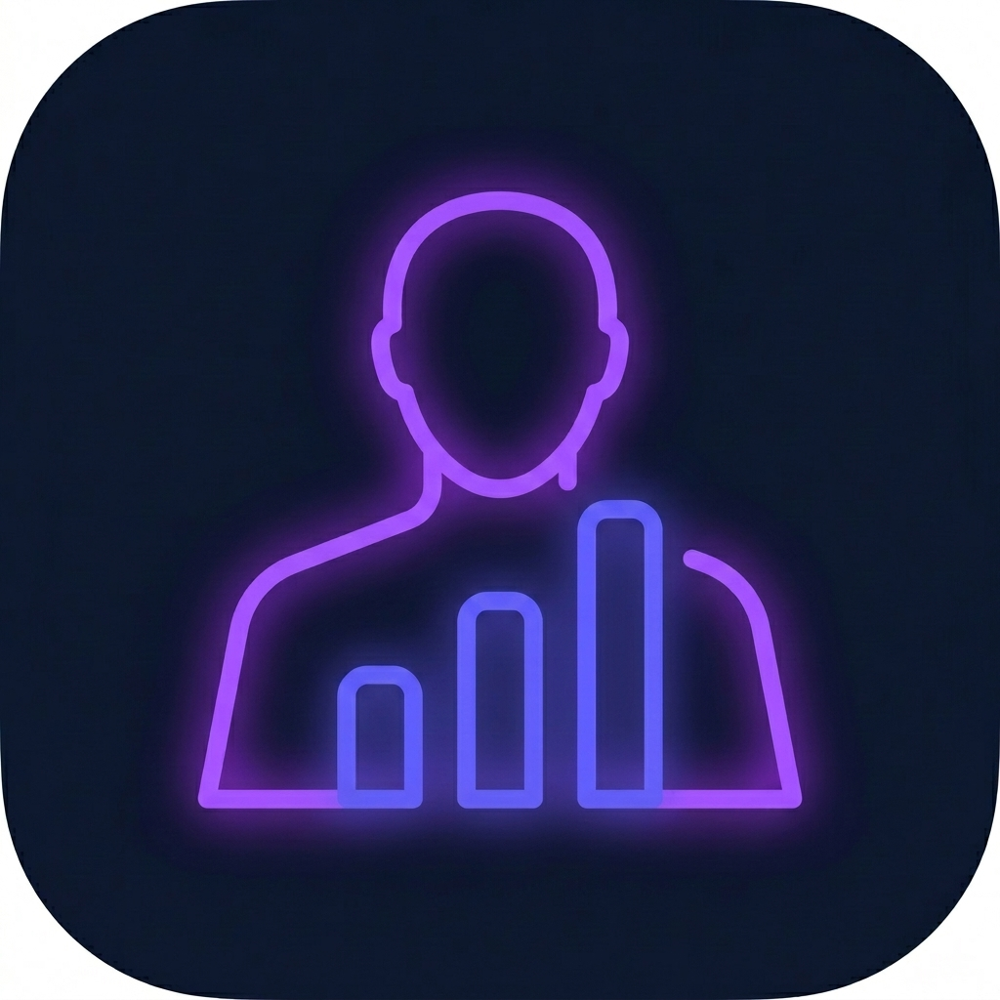

### **Next-Generation Body Composition & Health Tracking PWA / Android App**

A premium, mobile-first, offline-first health tracking application designed to monitor body mass, body composition (BIA), segmental muscle/fat distribution, tape measurements, and progressive goals with interactive charts and connected Bluetooth scales.

[](https://github.com/DevOpsBenjamin/SimpleBodyGraph)
[](https://vuejs.org/)
[](https://vitejs.dev/)
[](https://tailwindcss.com/)
[](https://capacitorjs.com/)
[](https://supabase.com/)
[](#-testing--quality-assurance)
[](LICENSE)

</div>

---

## 📱 Visual Showcase

<div align="center">

| 📊 Tableau de Bord Mensuel | 📅 Tendance Hebdomadaire | 🧬 Analyse Segmentaire BIA |
| :---: | :---: | :---: |
| 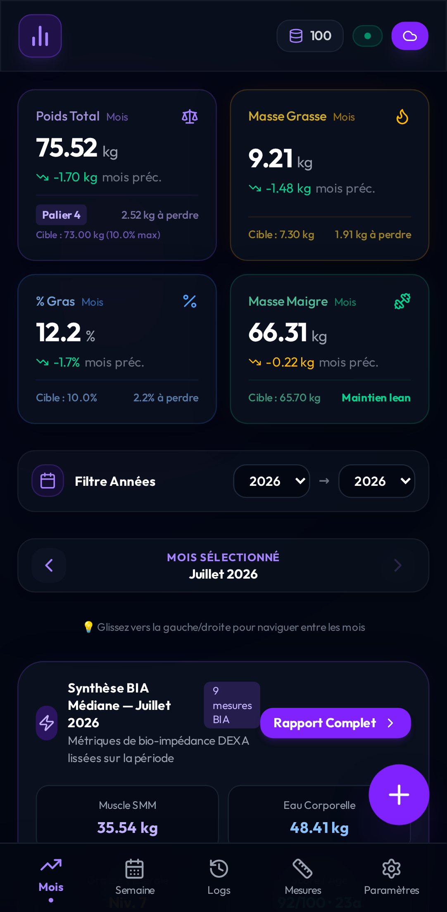 | 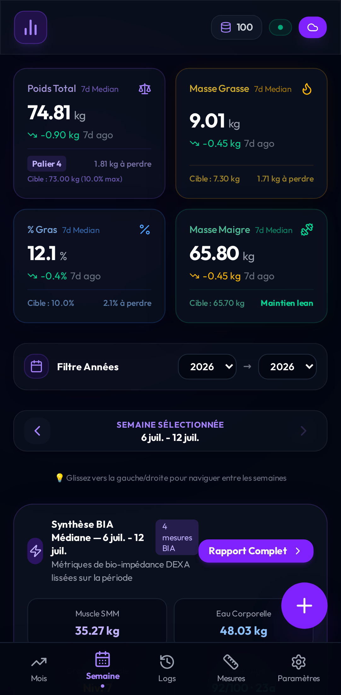 | 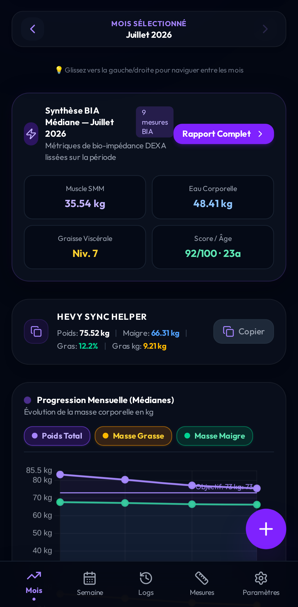 |

| 📋 Rapport Clinique BIA | 📏 Mensurations Ruban | 📜 Historique & Statuts |
| :---: | :---: | :---: |
| 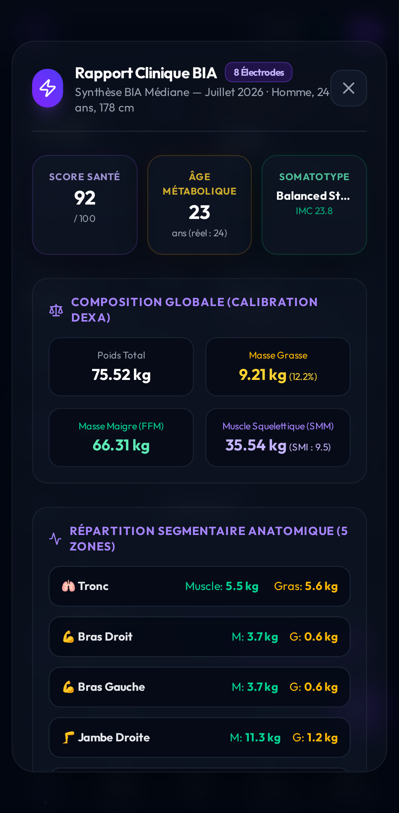 | 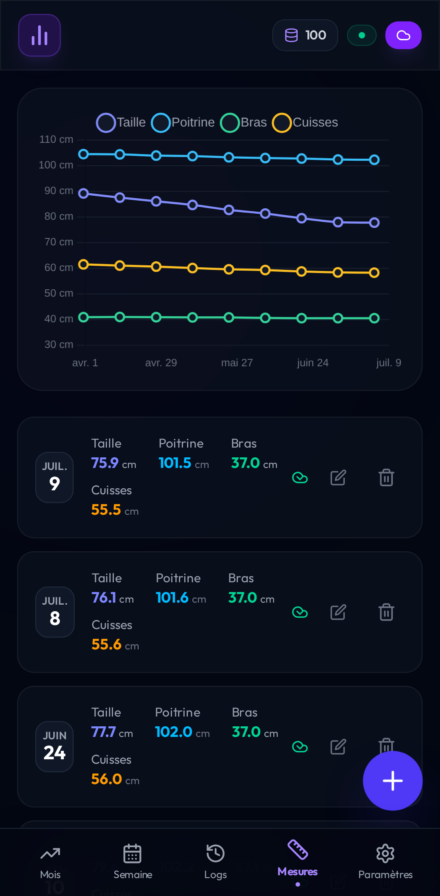 | 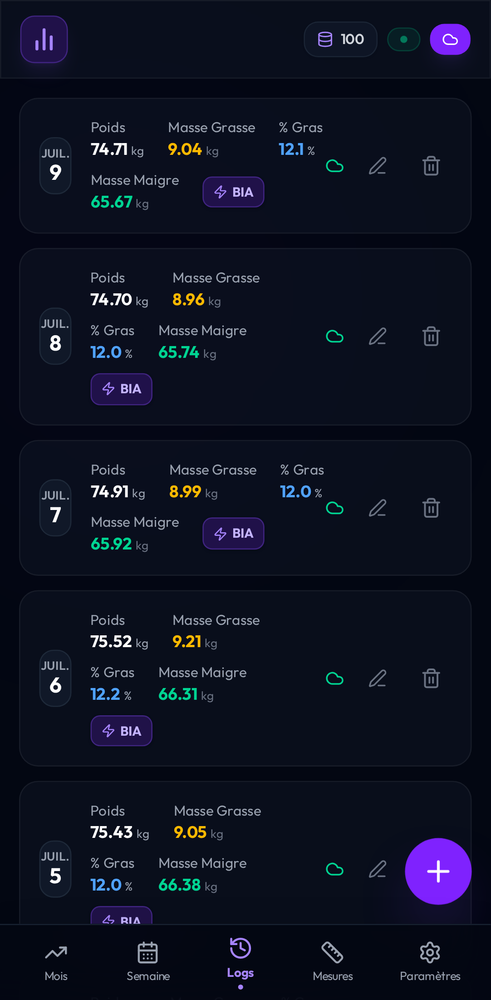 |

| 🎯 Paliers & Objectifs | ⚖️ Balances Connectées (BLE) | 👁️ Préférences d'Affichage |
| :---: | :---: | :---: |
| 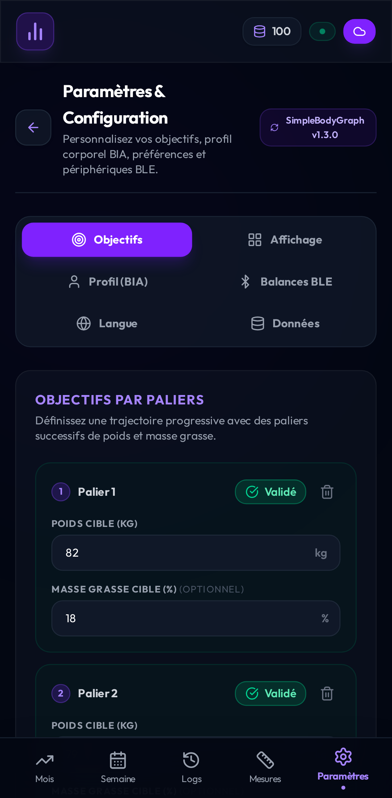 | 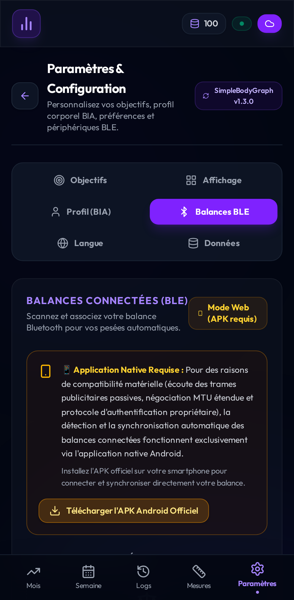 | 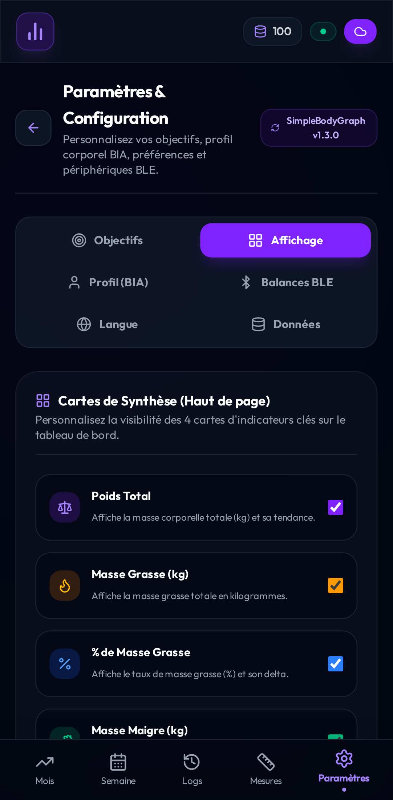 |

| 👤 Profil Utilisateur (BIA) | 💾 Données & Sauvegarde Cloud | 🌐 Internationalisation (i18n) |
| :---: | :---: | :---: |
| 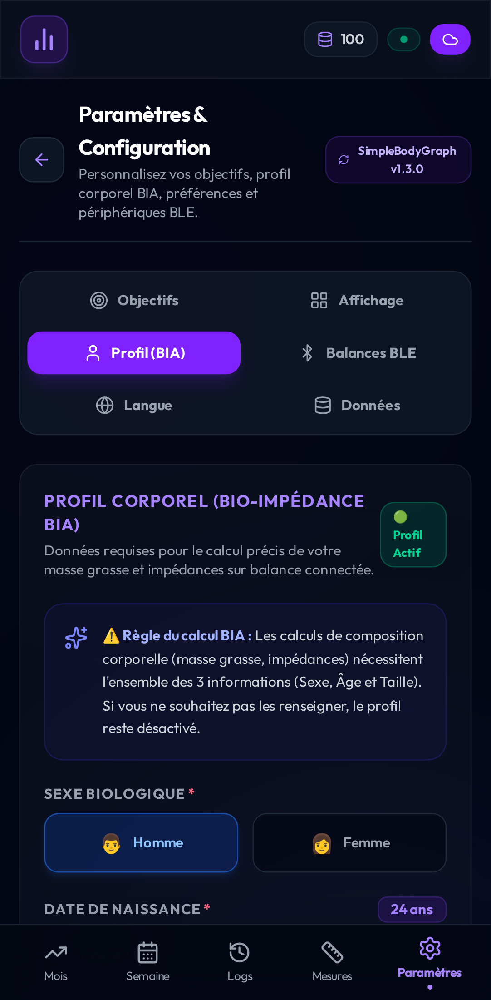 | 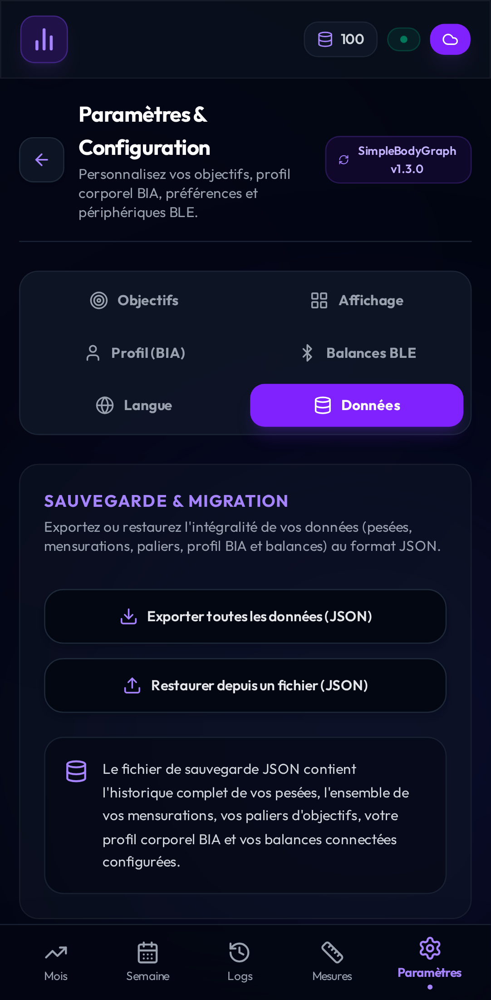 | 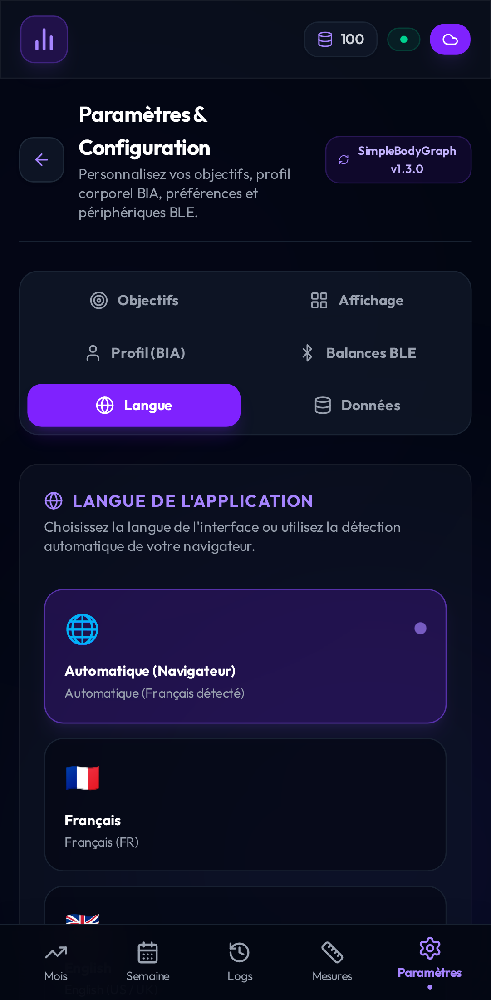 |

</div>

---

## ✨ Key Features

### ⚖️ Connected Bluetooth LE Scales (HUAWEI Scale 3 & Multi-Scale Engine)
* **ScaleManager & Driver Architecture**: Extensible driver registry (`BaseScaleDriver`, `HuaweiScale3Driver`) supporting auto-discovery, custom pairing workflows, and cryptographic authentication.
* **Live Weigh-In Modal**: Real-time weight streaming, impedance measurement detection, stability indicators, and animated feedback.
* **HUAWEI Scale 3 / Scale 3 Pro Support**: Proprietary crypto handshake (HUID / User Profile negotiation), 8-electrode segmental impedance decoding, and direct native BLE connectivity on Android.

### 🧬 Clinical Bioelectrical Impedance Analysis (BIA) Engine
* **DEXA-Calibrated Modeling**: Advanced multi-frequency calculation estimating:
  * **Global Body Composition**: Total Mass (kg), Fat Mass (kg), Body Fat (%), Lean Mass / Fat-Free Mass (FFM kg), Skeletal Muscle Mass (SMM kg), Skeletal Muscle Index (SMI), Bone Mineral Content (kg).
  * **Hydration Compartments**: Total Body Water (TBW), Intracellular Water (ICW), Extracellular Water (ECW), and ECW/TBW ratio.
  * **Metabolism & Health**: Visceral Fat Level (VFL), Basal Metabolic Rate (BMR kcal/day), Metabolic Age, Somatotype classification, and Global Health Score (0-100).
  * **5-Zone Segmental Distribution**: Muscle and Fat mass broken down across Tronc, Bras Droit, Bras Gauche, Jambe Droite, and Jambe Gauche.
* **Full Clinical Report Modal**: In-depth medical-grade visual summary accessible directly from the dashboard and logs.

### 📈 Smart Dashboard & Dynamic Visualizations
* **Contextual 4-Metric KPI Cards**: Instant visibility on Poids Total, Masse Grasse, % Gras, and Masse Maigre with comparison indicators (vs. previous month / 7-day rolling baseline).
* **Multi-Tab Period Tracking**: Switch between **Mois** (monthly medians), **Semaine** (7-day rolling median), **Logs** (raw history), and **Mesures** (tape tracking).
* **High-Performance Charts**: Interactive **Chart.js** line visualizations with custom neon glowing gradients, smooth curves, goal milestone overlays, and segmental breakdown charts.
* **Hevy Sync Helper**: One-tap quick copy utility formatted for fitness logging apps.

### 🎯 Milestone Target Goals (Paliers)
* **Progressive Multi-Stage Targets**: Define sequential milestones for weight and body fat reduction or muscle gain.
* **Automatic Validation**: Automatically checks rolling median trends against milestone criteria to validate goals without manual intervention.

### 📏 Body Tape Measurements
* Track key anatomical circumferences: Tour de taille (Waist), Poitrine (Chest), Bras (Arms), Cuisses (Thighs), Mollets, Cou, etc.
* Dedicated interactive evolution chart and chronological measurement logs.

### 🌐 Full Internationalization (i18n)
* Complete bilingual support for **Français (FR)** and **English (EN)**.
* Instant runtime language toggle in settings with automatic persistence.

### 🔌 Offline-First Engine & Cloud Synchronization
* **Instant Local Persistence**: All operations are saved locally in **IndexedDB** first, providing sub-millisecond response times even completely offline.
* **Sanitized Proxy & DataClone Safe**: Robust serialization pipeline preventing `DataCloneError` when storing reactive objects and complex impedance structures.
* **Supabase Smart Sync**: Automatic bidirectional synchronization with remote cloud database when connection is detected, with dedicated offline deletion queues and Guest-to-User account migration.

### 📱 Android Native App (Capacitor) & In-App Updates
* Native Android build powered by **Capacitor 8** with signed APK distribution.
* Automatic GitHub Releases update checker with seamless in-app notification banner and direct APK downloads.
* Deep-linking OAuth support for Supabase cloud authentication.

---

## 🛠️ Architecture & Tech Stack

```
SimpleBodyGraph
├── src/
│   ├── components/            # Modular Vue components (Dashboard, Modals, Settings tabs, Charts)
│   │   ├── BiaSegmentalChart.vue
│   │   ├── UnifiedCompositionChart.vue
│   │   ├── ScaleWeighInModal.vue
│   │   ├── ScalePairingModal.vue
│   │   ├── SettingsGoalsTab.vue
│   │   ├── SettingsProfileTab.vue
│   │   ├── SettingsDevicesTab.vue
│   │   ├── SettingsDisplayTab.vue
│   │   ├── SettingsLanguageTab.vue
│   │   ├── SettingsDataTab.vue
│   │   └── ...
│   ├── stores/                # Pinia Domain Stores
│   │   ├── bodyGraph.js       # Core dashboard, period calculations, & sync orchestration
│   │   ├── auth.js            # User session, Supabase Auth, & OAuth deep linking
│   │   ├── goals.js           # Paliers, milestone validations, & progression logic
│   │   └── settings.js        # BIA Profile, display preferences, & scale devices
│   ├── services/              # Business & Hardware Services
│   │   ├── bia/               # Clinical BIA algorithms & multi-frequency equations
│   │   ├── ble/               # Bluetooth Scale Manager & Scale Drivers (Huawei Scale 3)
│   │   ├── authService.js     # Supabase auth integrations
│   │   └── updateService.js   # GitHub Releases APK auto-updater
│   ├── db/                    # Modular IndexedDB Layer
│   │   ├── core.js            # DB connection, schema migrations, & bulkWrite engine
│   │   ├── logsStore.js       # Weigh-in logs CRUD & queries
│   │   ├── measurementsStore.js # Tape measurements CRUD & queries
│   │   ├── syncService.js     # Bidirectional Supabase cloud sync & offline queues
│   │   └── exportImportService.js # Full JSON dataset export / import & Guest migration
│   └── i18n/                  # Localization (fr.js, en.js)
├── tests/                     # Test Suites (Vitest Unit & Playwright E2E)
│   ├── fixtures/              # Clinical 3-Month Seed Datasets
│   ├── *.unit.spec.js         # 160+ Vitest unit tests
│   └── *.spec.js              # Playwright E2E and visual verification tests
└── docs/screenshots/          # Comprehensive UI screenshot suite
```

---

## 🚀 Getting Started

### 1. Prerequisites
* **Node.js**: `v20+` or `v22+`
* **npm**: `v10+`

### 2. Installation
```bash
git clone https://github.com/DevOpsBenjamin/SimpleBodyGraph.git
cd SimpleBodyGraph
npm install
```

### 3. Environment Configuration
Create a `.env` file in the root directory:
```env
VITE_SUPABASE_URL=https://your-project.supabase.co
VITE_SUPABASE_ANON_KEY=your-supabase-anon-key
```
> **Note**: If no credentials are supplied, the application runs seamlessly in **Offline-Only Mode** with 100% feature availability locally in IndexedDB.

### 4. Development Server
```bash
npm run dev
```

### 5. Build for Production
```bash
npm run build
```

---

## 🧪 Testing & Quality Assurance

SimpleBodyGraph adheres to a strict unified testing strategy based on a global 3-month clinical dataset seed (`tests/db-helper.js` and `tests/fixtures/bia_cut_85to75_dataset.json`).

### Run Unit Tests (Vitest)
Executes 160+ unit tests covering BIA equations, store state transitions, BLE crypto, and database helpers:
```bash
npm run test:unit
```

### Run End-to-End Tests (Playwright)
Executes full browser E2E flows (IndexedDB persistence, visual regression, speed benchmarks):
```bash
npm run test:e2e
```

### Run Full Test Suite
```bash
npm run test:all
```

---

## 📱 Android Build (Capacitor)

SimpleBodyGraph is packaged as an Android application via Capacitor:

```bash
# 1. Build web assets and sync to Android
npm run cap:build

# 2. Open project in Android Studio
npm run cap:open
```

---

## 📊 Supabase Database Schema

Database migrations are managed via **Supabase CLI** under `supabase/migrations`.

### Logs Table (`logs`)
```sql
CREATE TABLE public.logs (
    id UUID PRIMARY KEY,
    date DATE NOT NULL,
    mass NUMERIC(5, 2) NOT NULL,
    body_fat NUMERIC(4, 2) NOT NULL,
    heart_rate INTEGER,
    impedance_raw JSONB,
    user_id UUID REFERENCES auth.users(id) DEFAULT auth.uid() NOT NULL,
    created_at TIMESTAMPTZ DEFAULT timezone('utc'::text, now()) NOT NULL
);

ALTER TABLE public.logs ENABLE ROW LEVEL SECURITY;

CREATE POLICY "Allow users to manage their own logs" 
ON public.logs FOR ALL 
USING (auth.uid() = user_id)
WITH CHECK (auth.uid() = user_id);

GRANT ALL ON public.logs TO authenticated;
```

### Measurements Table (`measurements`)
```sql
CREATE TABLE public.measurements (
    id UUID PRIMARY KEY,
    date DATE NOT NULL,
    waist NUMERIC(5, 2),
    chest NUMERIC(5, 2),
    arms NUMERIC(5, 2),
    thighs NUMERIC(5, 2),
    user_id UUID REFERENCES auth.users(id) DEFAULT auth.uid() NOT NULL,
    created_at TIMESTAMPTZ DEFAULT timezone('utc'::text, now()) NOT NULL
);

ALTER TABLE public.measurements ENABLE ROW LEVEL SECURITY;

CREATE POLICY "Allow users to manage their own measurements" 
ON public.measurements FOR ALL 
USING (auth.uid() = user_id)
WITH CHECK (auth.uid() = user_id);

GRANT ALL ON public.measurements TO authenticated;
```

---

## 📄 License

This project is licensed under the MIT License — see the [LICENSE](LICENSE) file for details.
